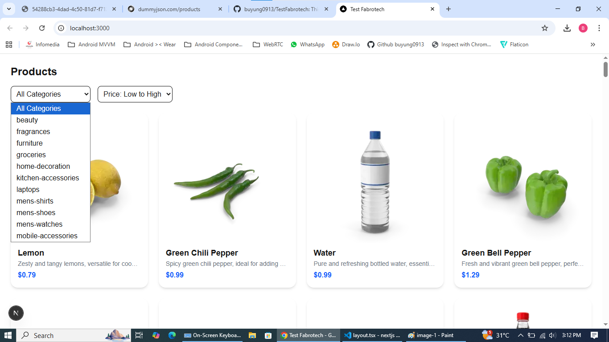
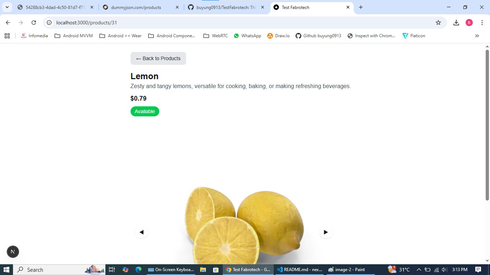
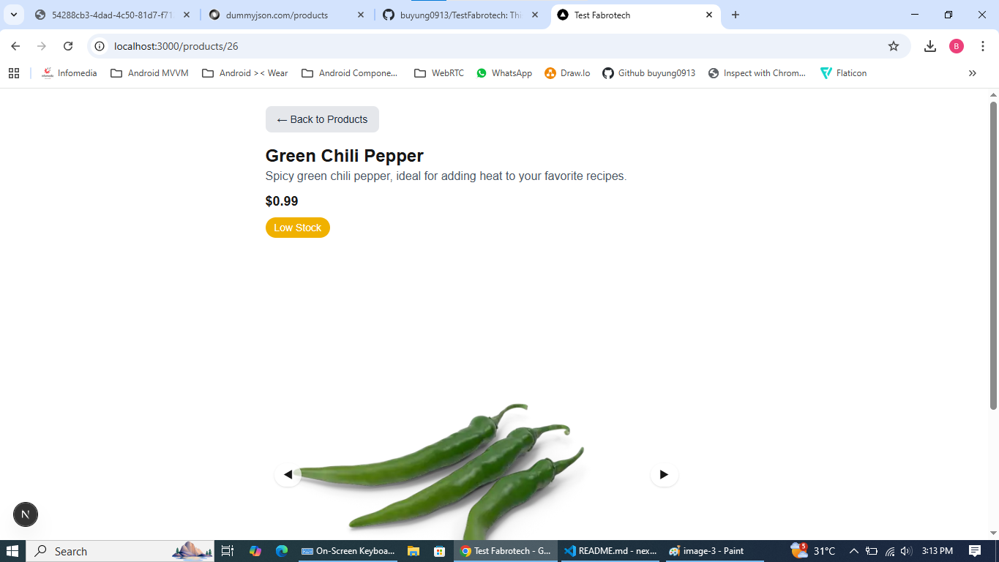
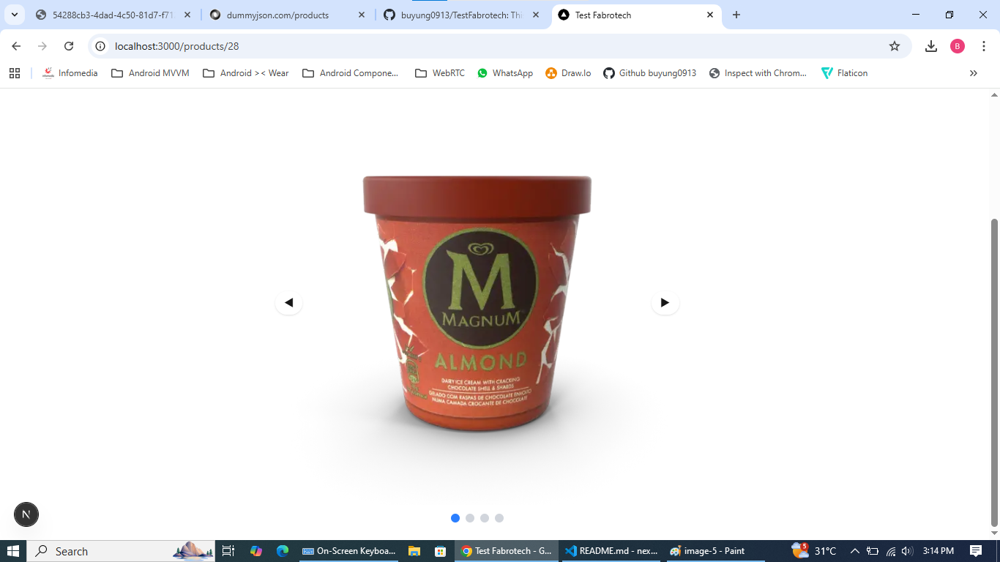
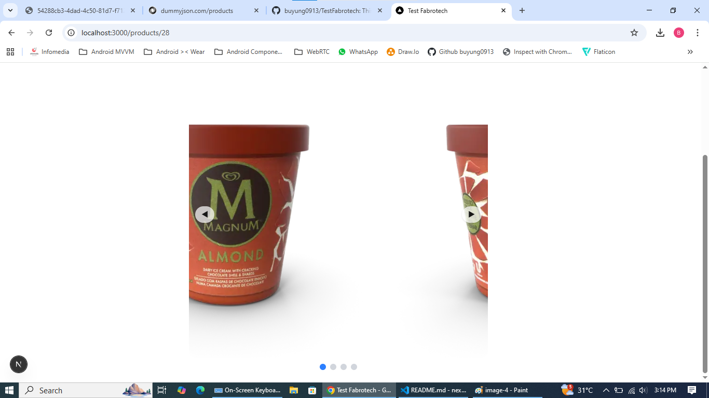

# Test Fabrotech - Next.js Product Catalog

This project is a **Next.js e-commerce product catalog** built with
modern tools and libraries.\
It fetches product data from [DummyJSON](https://dummyjson.com/products)
API and provides filtering, sorting, and detail views.

---

## 🚀 Features

- Product listing with **filter by category** and **sort by price**.
- Product detail page with:
  - **Image carousel** (using `embla-carousel-react`).
  - **Availability badge** (In Stock, Low Stock, Out of Stock).
  - Product description and pricing.
- Responsive design with **Tailwind CSS**.
- **Reusable components** for filtering, sorting, product cards, and
  carousel.
- **Static caching & revalidation** for API calls with Next.js
  `fetch`.
- **Optimized images** with Next.js `Image` component.

---

## 🛠️ Tech Stack

- [Next.js 14](https://nextjs.org/) -- React framework with App
  Router.
- [TypeScript](https://www.typescriptlang.org/) -- Type safety.
- [Tailwind CSS](https://tailwindcss.com/) -- Styling.
- [Embla Carousel](https://www.embla-carousel.com/) -- Lightweight
  carousel.
- [DummyJSON API](https://dummyjson.com/) -- Fake product API for
  testing.

---

## 📂 Project Structure

    /app
      /products
        [id]/page.tsx      -> Product detail page
        page.tsx           -> Product listing page
    /components
      ProductCard.tsx      -> Product card component
      ProductFilter.tsx    -> Category filter dropdown
      ProductSort.tsx      -> Sorting dropdown
      ProductCarousel.tsx  -> Image carousel
    /utils
      api.ts               -> API fetch helpers
    /app/layout.tsx        -> Root layout
    /app/globals.css       -> Global styles

---

## ⚙️ Getting Started

### 1️⃣ Clone repository

```bash
git clone https://github.com/buyung0913/TestFabrotech.git
cd test-fabrotech
```

### 2️⃣ Install dependencies

```bash
npm install
# or
yarn install
```

### 3️⃣ Run development server

```bash
npm run dev
# or
yarn dev
```

App runs on <http://localhost:3000>.

### 4️⃣ Build for production

```bash
npm run build
npm run start
```

---

## 📸 Screenshots









### Product Listing

- Filter products by category.
- Sort products by price.

### Product Detail

- Product image carousel.
- Stock availability badge.

---

## 📜 License

This project is licensed under the **MIT License**.

---

✨ Built with Next.js, Tailwind, and ❤️ for Fabrotech testing purposes.
"# TestFabrotech"
